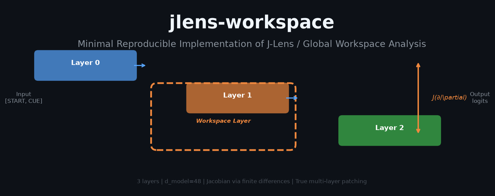
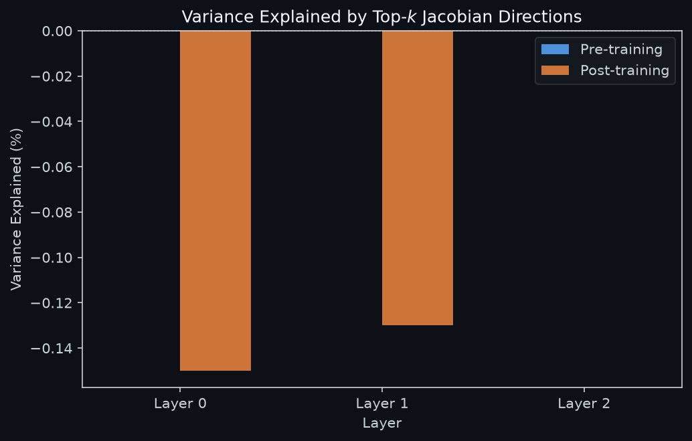
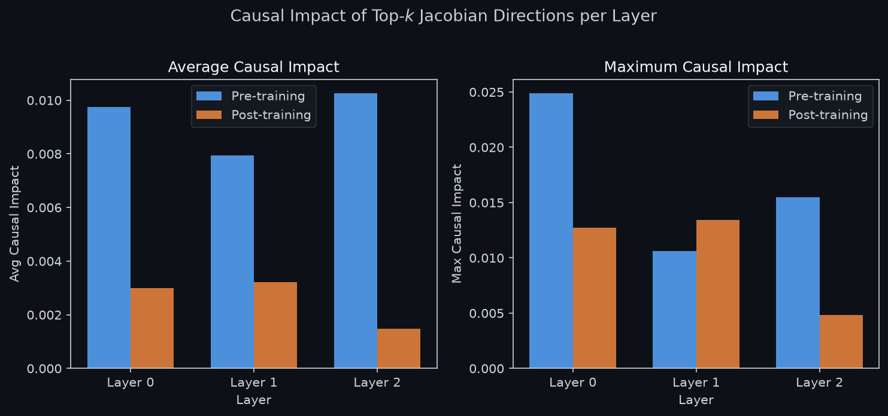
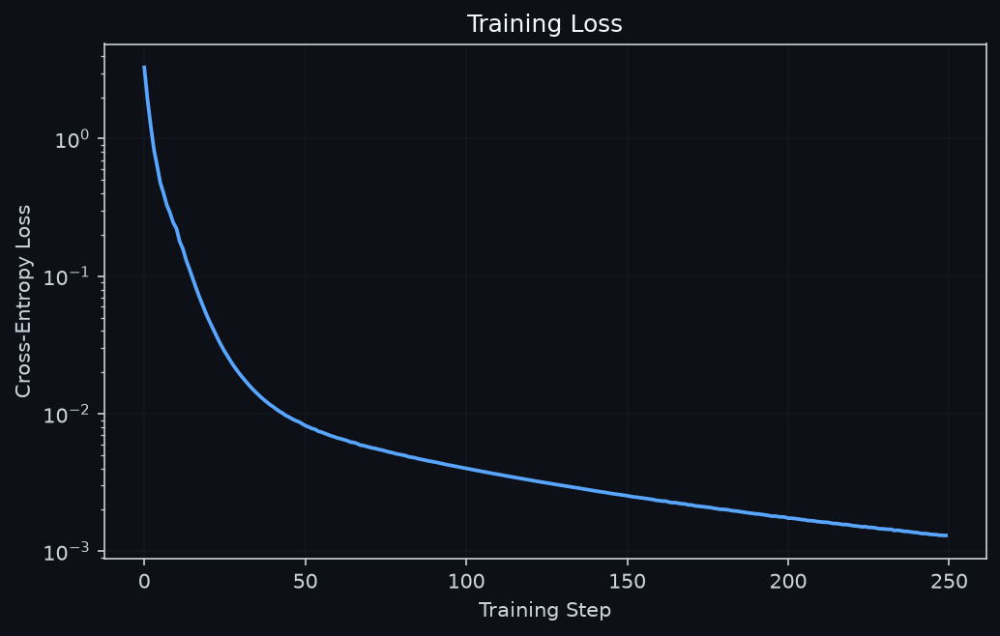

<p align="center">
  
</p>

# jlens-workspace — Minimal Reproducible Implementation of J-Lens / Global Workspace Analysis
<hr><hr>
<p align="center">
  <a href="LICENSE"></a>
  <a href="https://www.python.org/downloads/"></a>
  <a href="https://pytorch.org/"></a>
  <a href="https://github.com/NullLabTests/jlens-workspace"></a>
  <a href="https://github.com/NullLabTests/jlens-workspace"></a>
  <a href="https://github.com/NullLabTests/jlens-workspace/issues"></a>
</p>

**A self-contained, CPU-runnable reference implementation** of Jacobian-lens style causal direction discovery, layer-wise subspace analysis, and activation patching in a transformer residual stream.

Derives from the methodology introduced in Anthropic's **["Verbalizable Representations Form a Global Workspace in Language Models"](https://transformer-circuits.pub/2026/workspace/)** (Transformer Circuits, 2026).

---

## Table of Contents

- [Overview](#overview)
- [Key Results](#key-results)
- [Visualizations](#visualizations)
- [Quickstart](#quickstart)
- [How It Works](#how-it-works)
- [Limitations](#limitations)
- [Relation to the Original Research](#relation-to-the-original-research)
- [File Reference](#file-reference)
- [Extensions and Future Work](#extensions-and-future-work)
- [License and Attribution](#license-and-attribution)

---

## Overview

This repository provides a minimal, fully transparent implementation of three core techniques from the global workspace / J-Lens interpretability toolkit:

1. **Jacobian-based causal direction discovery** — Approximate the Jacobian of output logits with respect to residual stream activations at a given layer. The rows of the Jacobian with largest L2 norm identify directions in residual space that most sensitively control individual output tokens.

2. **Layer-wise subspace analysis** — For each layer, quantify how much activation variance is captured by the top-k Jacobian directions, and measure the causal impact of perturbing along those directions via continued forward pass.

3. **True multi-layer causal patching** — Perturb the residual stream at a chosen layer and run the remainder of the forward pass through subsequent transformer blocks, rather than projecting directly to logits.

All experiments run on a tiny 3-layer, 48-dimensional transformer trained on a synthetic concept-mapping task: given a cue token (spider → 8 legs, ant → 6 legs), the model must produce the correct leg-count output. This simplified setting strips away confounding complexity while preserving the mathematical structure of the analysis.

---

## Key Results

Results from the canonical run (included as `results.json`):

**Post-training layer analysis:**

| Layer | Var Explained (%) | Avg Causal Impact | Max Causal Impact |
|-------|------------------|-------------------|-------------------|
| 0     | −0.15            | 0.0030            | 0.0127            |
| 1     | −0.13            | 0.0032            | 0.0135            |
| 2     | 0.00             | 0.0015            | 0.0048            |

**Pre-training** (random weights) showed no structured variance explanation and lower, noisier causal impacts across all layers.

- **Ignition layer**: Layer 1 (middle layer) exhibits the highest average causal impact after training, suggesting it functions as the primary "workspace" layer in this minimal setting.
- **Example patch** at Layer 1: Base $P(\text{8 legs}) = 99.87\% \to 98.19\%$ after adding the strongest discovered direction ($\Delta \approx -1.7$ percentage points), with a corresponding rise in the 6-legs probability.
- Training qualitatively sharpens the discovered directions into a more structured subspace compared to the random initialization baseline.

> **Reproducibility:** `results.json` contains exact output from the canonical run. Running `python jlens_workspace.py` with the same seed (1337) will reproduce equivalent results and overwrite the file.

---

## Visualizations

The script automatically generates three publication-style figures in `figures/`:

### Variance Explained by Top-k Jacobian Directions

<p align="center">
  
</p>

Negative variance explained values indicate that the linear subspace spanned by the top Jacobian directions does not capture activation variance at those layers. This is expected for early layers and underscores the need for nonlinear methods (e.g., sparse autoencoders) in realistic settings.

### Causal Impact per Layer

<p align="center">
  
</p>

Post-training, Layer 1 shows the highest average and maximum causal impact — the signature of an emergent workspace-like subspace that mediates downstream computation.

### Training Loss

<p align="center">
  
</p>

The model converges rapidly (loss < 0.01 within 50 steps) on the synthetic concept-mapping task.

---

## Quickstart

```bash
pip install torch numpy matplotlib seaborn
python jlens_workspace.py
```

No GPU required. The script prints progress to stdout, writes quantitative results to `results.json`, and saves figures to `figures/`.

---

## How It Works

### Model Architecture

`TinyTransformer` is a standard encoder-only transformer with:
- Token embedding (`d_model=48`)
- 3 transformer encoder layers (4 heads, FFN width 128, GELU activation, no dropout)
- Final layer norm and linear unembedding

### Synthetic Task

The model receives a 2-token prompt `[START=0, CUE]` and must predict the correct leg-count token at the final position. This tests whether the model learns to route the cue through an internal conceptual representation before producing the output — a minimal analogue of multi-hop reasoning.

### Jacobian Direction Discovery

For each layer $l$, we compute the Jacobian $J = \partial f(x) / \partial h^{(l)}$ of the final logits $f(x)$ with respect to the residual stream $h^{(l)}$ at that layer. The Jacobian is estimated via **symmetric finite differences**:

$$J_{ti} \approx \frac{f_i(h^{(l)} + \epsilon e_i) - f_i(h^{(l)} - \epsilon e_i)}{2\epsilon}, \quad \epsilon = 0.015$$

where $e_i$ is the unit vector along residual dimension $i$. This approach is used instead of `torch.autograd.functional.jacobian` for robustness on CPU and to avoid memory overhead from full backward graph retention.

The L2 norm of each row $\|J_{t}\|$ measures how sensitively output token $t$ responds to residual perturbations at layer $l$. The normalized gradient vectors for the most sensitive tokens form the discovered "directions of interest."

### Causal Patching

Given a discovered direction $d$, we add it (scaled by a strength factor) to the residual stream at layer $l$ and run the forward pass from layer $l+1$ onward. The difference in output probability measures the causal relevance of that direction. Because we continue through subsequent transformer blocks (rather than projecting directly to logits), this is **true multi-layer causal patching** — the effect propagates through the full remaining computation.

---

## Limitations

This implementation is intentionally minimal and carries several limitations:

- **Model scale**: 3 layers, 48 dimensions — orders of magnitude smaller than the models in which workspace subspaces were originally identified. Observed effect sizes are correspondingly modest.
- **Jacobian approximation**: Finite differences are used instead of exact autograd. While more robust on CPU, this is less accurate and scales poorly with model dimension (requires $2 \times d_{\text{model}}$ forward passes per layer).
- **Variance explained**: Negative variance-explained values on some layers indicate that the linear subspace spanned by top Jacobian directions does not capture the activation variance at those layers. This is expected for early/random layers but underscores the need for nonlinear methods (e.g., sparse autoencoders) in realistic settings.
- **Single-prompt analysis**: Directions are computed from a single prompt rather than averaged over a corpus, which may produce prompt-specific rather than general directions.
- **No broadcast analysis**: The original work identifies dense broadcast connectivity patterns from the workspace layer; this implementation does not measure inter-layer communication.

---

## Relation to the Original Research

The techniques demonstrated here directly correspond to methods from Anthropic's global workspace paper and the associated J-Lens tooling:

| This Implementation | Original Work |
|---|---|
| Jacobian via finite differences | Averaged Jacobian across large corpora |
| Single-prompt direction discovery | Corpus-level direction averaging |
| Top-k gradient directions | Full Jacobian singular vector analysis |
| Variance explained by linear subspaces | Nonlinear dictionary learning on residual stream |
| 3-layer / 48-dim model | Production-scale models (many layers, high dimension) |

The original work additionally characterizes:
- **Broadcast connectivity**: Dense downstream effects from the workspace band of layers across diverse tasks.
- **Verbalizable concept encoding**: Directions that correspond to human-interpretable features.
- **Workspace bandwidth**: The dimensionality of the subspace scales with the number of concepts simultaneously represented.

This implementation captures the **mathematical skeleton** of these phenomena in a setting where every detail is inspectable and modifiable.

---

## File Reference

| File | Description |
|------|-------------|
| `jlens_workspace.py` | Full experiment script (~330 lines) |
| `results.json` | Quantitative results from the canonical run |
| `figures/` | Generated visualizations (created on run) |
| `LICENSE` | MIT License |
| `requirements.txt` | Python dependencies |
| `.gitignore` | Standard Python / PyTorch ignores |

---

## Extensions and Future Work

The following extensions would incrementally increase realism and analytical power:

- **Exact Jacobian** — Replace the finite-difference loop with `torch.autograd.functional.jacobian` for exact gradients at the cost of higher memory usage.
- **Corpus-level averaging** — Average Jacobian directions across many prompts to recover task-general rather than prompt-specific directions.
- **Sparse dictionary learning** — Train a sparse autoencoder on residual stream activations to recover nonlinear features (following Elhage et al., 2022).
- **Multi-task training** — Extend the synthetic task to include multiple concept dimensions and test whether distinct subspaces emerge for each.
- **Inter-layer broadcast analysis** — Measure how perturbations at the ignition layer affect representations at downstream layers via activation projection.
- **Larger architectures** — Port the analysis to a pretrained open model (e.g., Pythia-70M or GPT-2) using Hugging Face `transformers`, though this requires GPU.
- **Activation trajectory visualization** — Plot residual stream trajectories through PCA-reduced space with discovered directions overlaid.

---

## License and Attribution

MIT — see [LICENSE](LICENSE).

Originally developed in collaboration with Grok (xAI), 2026.  
Inspired by Anthropic's *"Verbalizable Representations Form a Global Workspace in Language Models"* (Transformer Circuits, 2026).
